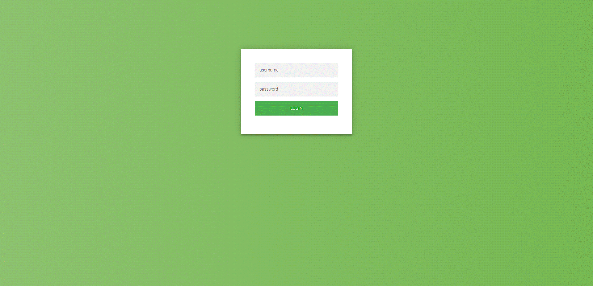
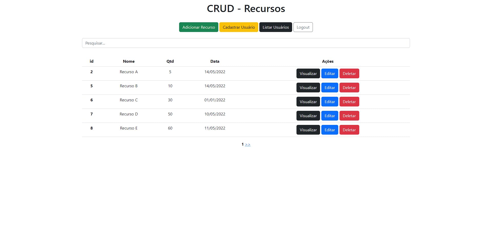
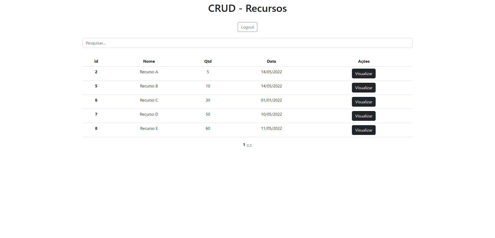
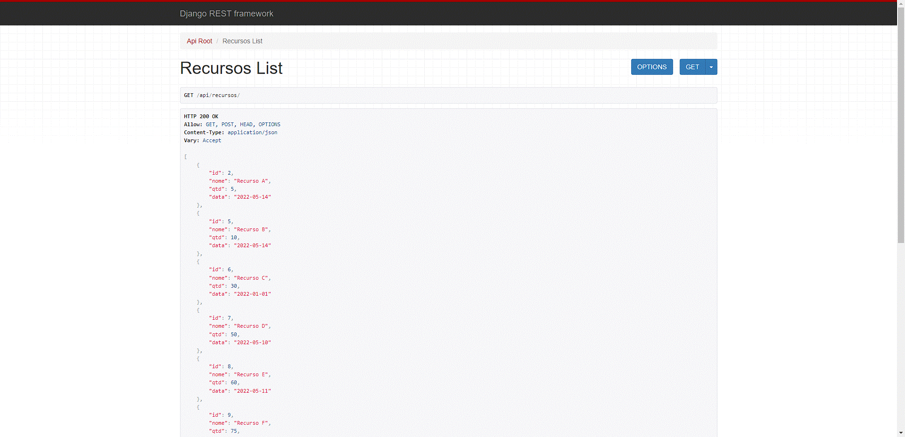
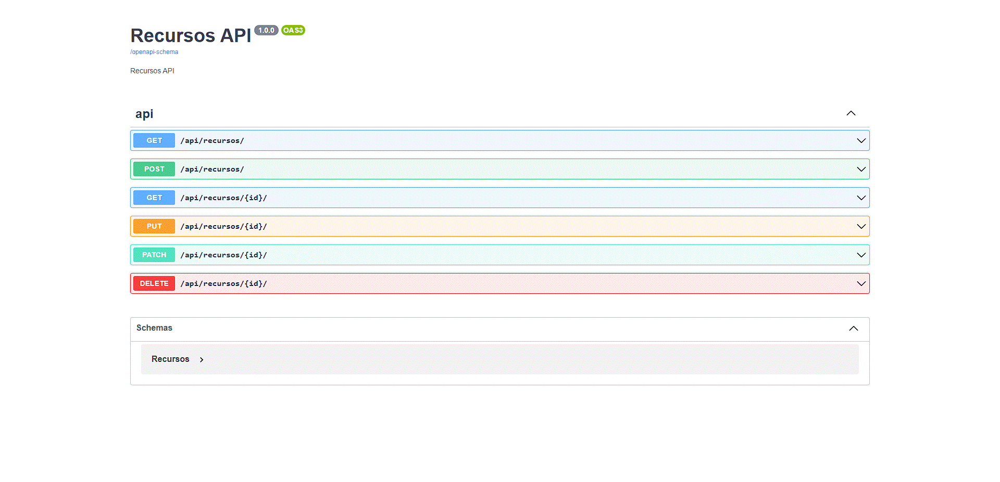
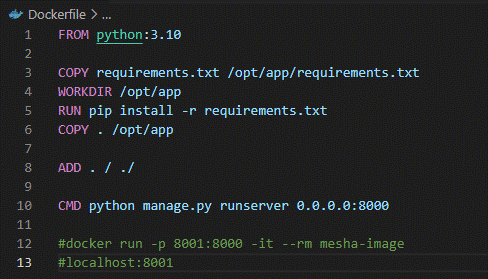
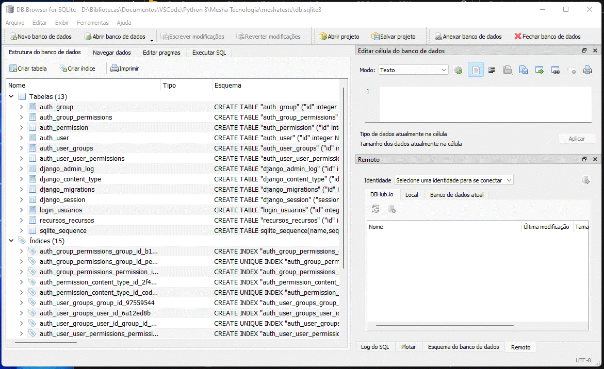

# Resumo - Screenshots e lista de requisitos

### Tela de Login

### Home - Admin

### Home - Usuário comum

### API - Django

### API - Swagger

### Dockerfile

### DB utilizado: SQLite

### Requisitos
- [x] Admin e usuário comum
- [x] Criação e exclusão de usuários comuns
- [x] Criação, Leitura, Atualização e Exclusão de Recursos
- [x] API Python - Django
- [x] Documentação da API - Swagger
- [x] Banco relacional - SQLite
- [x] Dockerfile
- [ ] Alocar recursos por um tempo determinado (não finalizado)

### Extras (não requisitados)
- [x] Bootstrap
- [x] Paginação
- [x] Busca por nome
- [x] Pipenv e requirements
- [x] Variáveis de sessão
- [ ] Middleware de autenticação - login (não finalizado)

Teste enviado com antecedência devido à complicações de saúde. Realizarei exames que comprometerão meu último dia de teste. Agradeço a compreensão!
